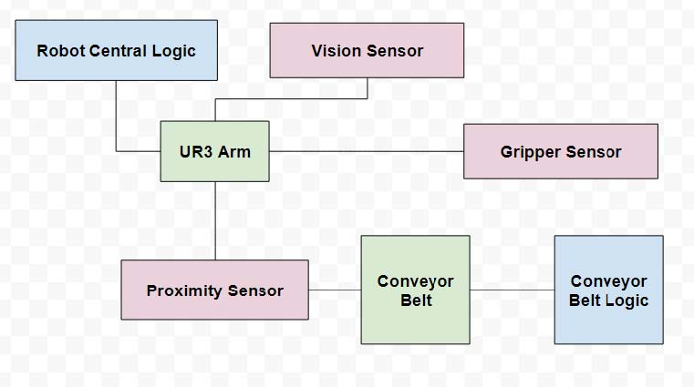

# Team Cleaner Pastures - ECE 470 Group Project
## Team:
- Vyom Thakkar - vnt2@illinois.edu
- Neeloy Chakraborty - neeloyc2@illinois.edu
- Nikhil Simha - simha3@illinois.edu

## Goals:
- Work with the UR3 robot in CoppeliaSim (previously VREP)
- Move different colored blocks towards a UR3 on a converyor belt
- Stop the conveyor belt once a block passes by proximity sensor
- Move the robot end effector to the block using forward kinematics
- Decide which location to place the block, depending on its color
- Place the block in that location using inverse kinematics

# Final Update - 5/15/2020
Code under the final/ directory  
Demo: https://www.youtube.com/watch?v=pLc1tVorXGs 

## Final Cleaner Pastures Simulation

All of the previous checkpoints have cumulated into this final simulation. The 'cleaner_pastures.py' script works in collaboration with the 'cleaner_pastures.ttt' scene to simulate our sorting robot.

In order to run this demo:
- Download and install CoppeliaSim if you haven't already.
- Download and install Anaconda3 (which comes with the Spyder IDE) if you haven't already.
- Open the "cleaner_pastures.ttt" scene.
- Open "cleaner_pastures.py" in the Spyder IDE.
- In the LUA command box within CoppeliaSim, run "simExtRemoteApiStart (19999)".
- In Spyder, run the "cleaner_pastures.py" code.
- In CoppeliaSim, observe red and green blocks that are coming down the conveyor belt are sorted by the UR3 robot.

To cleanly stop the demo:
- Stop the python script in the Spyder IDE.
- Stop the simulation in CoppeliaSim.

# Update 3 - 4/12/2020
Code under the update_3/ directory  
Demo: https://www.youtube.com/watch?v=qfTdH86_fEA 

## Inverse Kinematics

We have created a new python script 'inverse.py', which will produce the joint angles the UR3 should be placed in, in order to reach a given end effector pose.

In order to run this demo:
- Download and install CoppeliaSim if you haven't already.
- Download and install Anaconda3 (which comes with the Spyder IDE) if you haven't already.
- Open the "waypoint_draft.ttt" scene.
- Open "inverse.py" in the Spyder IDE.
- In the LUA command box within CoppeliaSim, run "simExtRemoteApiStart (19999)".
- In Spyder, run the "inverse.py" code.
- Enter 9 floats for the rotation matrix of the end effector in row major order.
- Enter 3 floats for the translation matrix of the end effector in row major order.
- Observe the produced joint angles in the console.
- Observe in the CoppeliaSim window that the end effector moves to the pose given.

## Planning & Decision

Our plan for implementing planning and decision on the UR3 is showcased in the following block diagram:

# Update 2 - 3/22/2020
Code under the update_2/ directory  
Demo: https://www.youtube.com/watch?v=czLAfamQkOA 

## Forward Kinematics

We have modified the provided 'example.py' file from class to produce a homogeneous transformation matrix for the end effector, given 6 joint angles for the robot to move its joints to.

In order to run this demo:
- Download and install CoppeliaSim if you haven't already.
- Download and install Anaconda3 (which comes with the Spyder IDE) if you haven't already.
- Open the "waypoint_draft.ttt" scene.
- Open "forward.py" in the Spyder IDE.
- In the LUA command box within CoppeliaSim, run "simExtRemoteApiStart (19999)".
- In Spyder, run the "forward.py" code.
- Enter 6 joint angle values (floats) in the console; for example: 90 90 90 0 0 0.
- Observe the produced transformation matrix in the console.
- Observe in the CoppeliaSim window that the arm moves to the joints specified.

## Conveyor Belt

We have created a new scene in CoppeliaSim to incorporate a conveyor belt into. When the scene runs, a laptop drops onto the conveyor belt, and stops as soon as it passes through a proximity sensor. The laptop will be switched out for a block at a later time.

In order to run this demo:
- Download and install CoppeliaSim if you haven't already.
- Download and install Anaconda3 (which comes with the Spyder IDE) if you haven't already.
- Open the "waypoint_draft.ttt" scene.
- Open "example.py" in the Spyder IDE.
- In the LUA command box within CoppeliaSim, run "simExtRemoteApiStart (19999)".
- In Spyder, run the "example.py" code.
- Observe in the CoppeliaSim window that the laptop drops onto the conveyor belt, and stops when it passes through the sensor.

# Update 1 - 2/16/2020
Code under the update_1/ directory  
Demo: https://www.youtube.com/watch?v=JmGm6Uzm1B0 

## Robot Motion

Using the provided 'example.py' file from the class, we have been able to program a UR3 robot arm to move to three different waypoints with the remote python api.

In order to run this demo:
- Download and install CoppeliaSim if you haven't already.
- Download and install Anaconda3 (which comes with the Spyder IDE) if you haven't already.
- Open the "ece470_sim.ttt" scene.
- Open "example.py" in the Spyder IDE.
- In the LUA command box within CoppeliaSim, run "simExtRemoteApiStart (19999)".
- In Spyder, run the "example.py" code.
- Observe in the CoppeliaSim window that the arm moves.

## Camera Vision

As of project update 1 we have a vision sensor that captures 2D images in our simulation. The vision sensor module is imperative in performing image classification tasks that we plan to implement in our project later. 

In order to demo the vision sensor :
- Download and install CoppeliaSim if you haven't already.
- Download and install Anaconda3 (which comes with the Spyder IDE) if you haven't already.
- Open the "ece470_sim.ttt" scene.
- Open the file "simpleTest.py" in the Spyder IDE.
- In the LUA command box within CoppeliaSim, run "simExtRemoteApiStart (19999)".
- Run the simulation in Coppelia by pressing the play button. 
- In Spyder, run the "simpleTest.py" code.
- Observe the 2D image from the vision sensor being displayed on the spyder terminal.

## Proximity Sensor

Currently the proximity sensor is not fully set up. However, the CoppeliaSim scene "trash-collection.ttt" contains the work that we have so far.
This work includes a UR3 arm with a non-functional proximity sensor, as well as a laptop placed above the sensor's range. Ideally, the laptop
will fall through and generate a reading from the proximity sensor, to help demonstrate functionality. As of now, the laptop falls, and we have
a graph of how far the laptop is from the robot during this fall, but we have not yet linked this to python code.

In order to run this demo:
- Download and install CoppeliaSim if you haven't already.
- Open the "trash-collection.ttt" scene.
- At the top bar click Simulation -> Start simulation.
- Observe the results on the graph within CoppeliaSim.
- Click Simulation -> Stop simulation.
